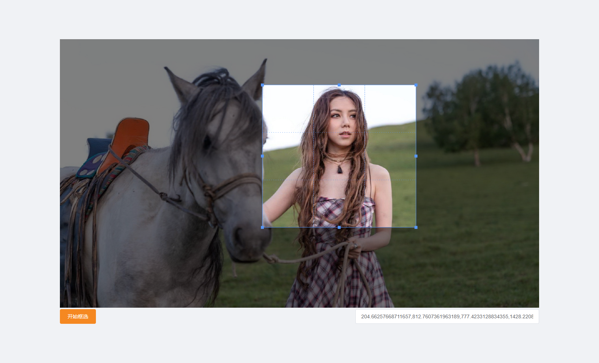

# canvas-render-img
> sample use element-ui


## 关键函数
- canvas.js
- canvasUtil.js

## 使用示例
> /src/views/sample/RenderImg.vue

#### 1. 绘制图片和矩形选框
1. 定义 canvas 元素

````html
<canvas id="sample-canvas-id"/>
````

2. 渲染 canvas 图片

````html
renderNormalImg () {
  this.$nextTick(() => {
    this.canvasBox = new CanvasBox(
      'sample-canvas-id',
      'https://www.hicooper.cn:8077/ajax/bucket/file/master/IMG/邓紫棋.jpg',
      [[[900, 190], [1350, 1070]], [[400, 80], [850, 1070]]], [],
      {
        width: this.imgWidth,
        height: this.imgHeight
      },
      false,
      this.selectRectDone
    )
  })
},
````

#### 2. 截图选框
> 先如上绘制图片
1. 开启选框
````html
// 开始自定义选框
startSelect () {
  if (this.canvasBox) {
    this.$message.info({
      duration: 5000,
      message: '按 ESC 退出选框'
    })
    this.canvasBox.registerListener()
    // 键盘按键监听
    window.addEventListener('keyup', this.handleKeyup)
    this.activeDrawRect = true
  }
},
````
````html
// 退出自定义选框
cancelSelect () {
  if (this.canvasBox) {
    this.canvasBox.unRegisterListener()
    window.removeEventListener('keyup', this.handleKeyup)
  }
  this.activeDrawRect = false
},
// 选框完成回调
selectRectDone (selectPosition, zoom) {
  const x1 = (selectPosition.x / zoom)
  const y1 = (selectPosition.y / zoom)
  const x2 = ((selectPosition.x + selectPosition.w) / zoom)
  const y2 = ((selectPosition.y + selectPosition.h) / zoom)
  this.coordinate = String([[[y1, x1], [y2, x2]]])
  console.log(this.coordinate)
},
// 键盘 esc 监听事件
handleKeyup (event) {
  if (isHotkey('esc', event)) {
    this.cancelSelect()
  }
}
````

2. 拖动选框
   
   
3. 完成选框
得到坐标


